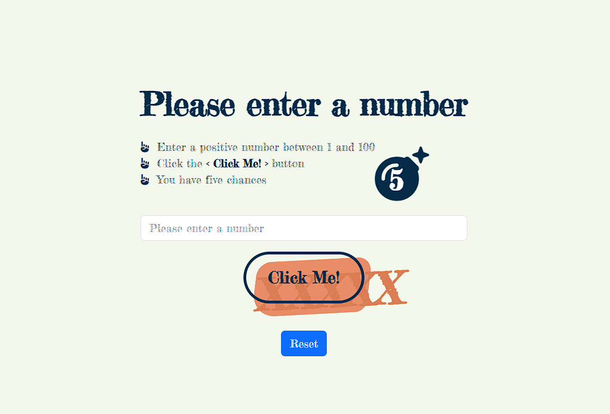

# :star2: A Number Game - Up! Down!

### :memo: Information 
> The number-guessing game involves guessing a number between 1 and 100. After each attempt, the result is displayed, and the player must guess the number before their attempts run out. If the player successfully guesses the number, the game ends. 

### :bookmark_tabs: Requirements
* At the start of the game, the computer generates a random number.
* The player inputs a number.
* If the player's number is lower than the computer's selection, the game displays "Up!"
* If the player's number is higher than the computer's selection, the game displays "Down!"
* If the player's number matches the random number, "Bingo!" is displayed and the game ends.
* The player has a total of 3 attempts.
* Once the game ends, the input button is disabled, and display a message
* Pressing the reset button will restart the game.
* Clear the input box when it's focused
* Validate user value
  * If the user value is out of the range, display an error  
  * If the user typed the same number, display a message, but do not increase the attempt
  * 
#### :moneybag: **Bonus**
* Responsible UI
* display user history
  
### 🔗 Demo: <a href="https://upupdown.netlify.app/" target="_blank">https://upupdown.netlify.app</a>

### Skills
  
  
 
 

